# Introduction
This is a wrapper for the Empyrion Mod API and a system to run mods without having to restart the game server.  It uses the existing TCP port used by EAH to connect to the game server.

# Getting Started

## Build
1.  Clone the code (recursively to include submodules).  Don't just download a .zip of the code.
2.  Load up in Visual Studio 2017
3.  Build all.

 ## Run
After building, the \NetworkConnectedModRunner\bin\Release (or Debug) folder will contain the .exe which will load an run any *Mod.dll found in the Extensions folder (or 1 folder deeper).
Make sure you configure the Settings.yaml file to point to the API port used by EAH.

# Contribute
Send bugs or send pull requests with any improvements, modules, or documentation.

# Included mods
| Module | Description |
|:-----------|:-----------|
| FactionStorage | Lets players in the same faction access a shared storage area. |
| PlayfieldStructureRegenMod | Regenerates POIs or asteriods when a playfield is loaded. |
| ShipBuyingMod | Lets players buy ships for credits. |
| StarterShipMod | Grants each player a one-time ship. |
| StructureOwnershipMod | It gives periodic rewards to any faction that captures the core of configured ships/buildings. You then use /income to take out the items you've earned. The idea is that it gives purpose in PVP to take over bases in space/planet. It also reduce the need to use autominers as you could capture a "steel block" factory or something. |
| VotingRewardMod | Calls empyrion-servers.com REST API to give configured rewards to players every day they vote. |
| SellToServer | (Deprecated as it's a part of game now) Lets you configure an area where you can type /sell and sell items back to the server for credits.  Prices are configured in yaml (including a default price if you want to accept any item). |
| DiscordBotMod | (Deprecated as it's a part of EAH now) Connects in-game general chat to a specific channel in your Discord server.  Two-way communication. |
| FactionPlayfieldKickerMod| (Deprecated as it's a part of EAH now) Keeps people not belonging to a specifc faction out of a playfield if they try to warp in. |

## DiscordBotMod

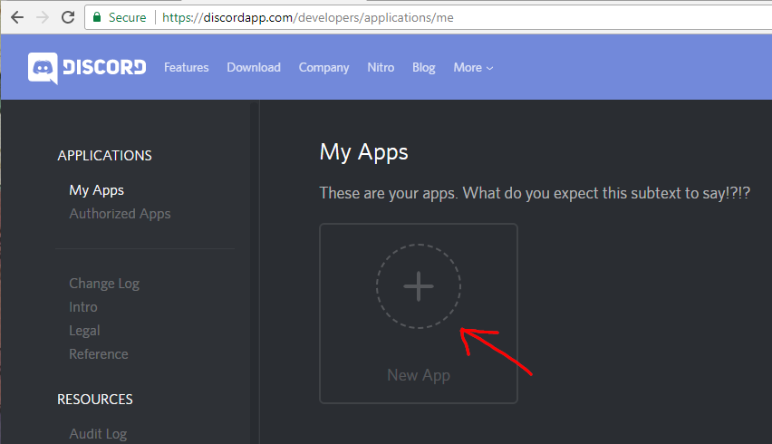

1) Navigate to [https://discordapp.com/developers/applications/me](https://discordapp.com/developers/applications/me)
2) Select and create a new App

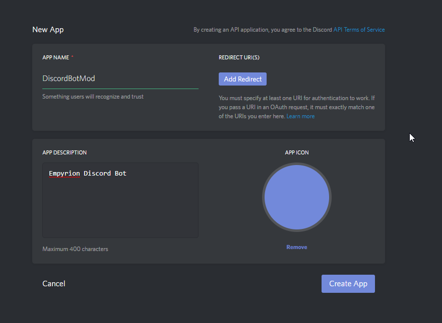

3) Enter in the application name for your mod
4) Enter in a description
5) Select Create App

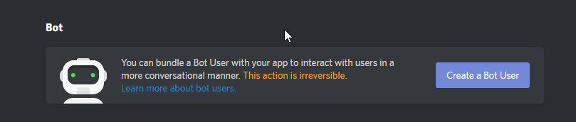

6) After your application has been created you will see the settings screen for your application,
   scroll down and in the Bot section click on `Create a Bot User`
   
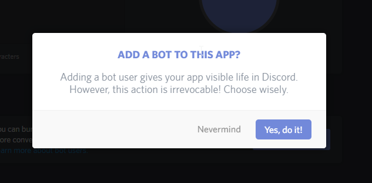

7) You will get a warning message stating that your bot will be visible after it's created.
   Go ahead and click `Yes, do it`.
   
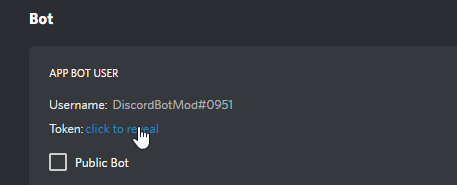

8) After your bot has been created you need to aquire your token.  Click on reveal token.

9) Copy your token to the clipboard

10) Paste it in your DiscordBotMod_Settings.yaml file in the DiscordToken property.

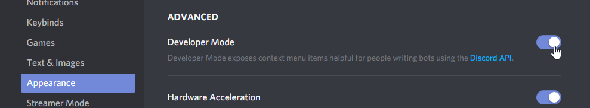

11) Back in discord go into the user settings and select the `Appearance` category.  Scroll down
    to where it says advanced and tick the `Developer Mode` option on.
    
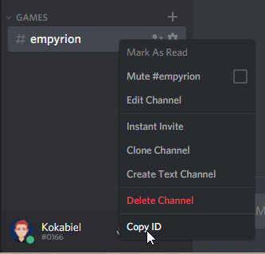

12) With the channel that you want the bot to be in, right click it and select `Copy ID`

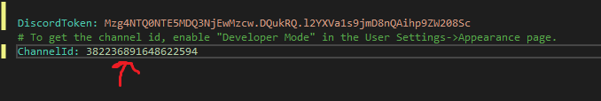

13) Paste the ID in the ChannelId property in DiscordBotMod_settings.yaml

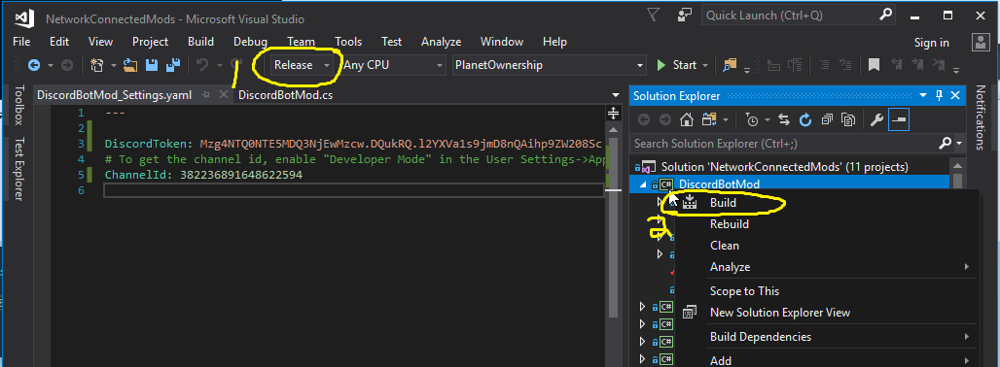

14) In visual studio right make sure your build configuration is set to `Release`
15) Right click on your DiscordBotMod project and select build.

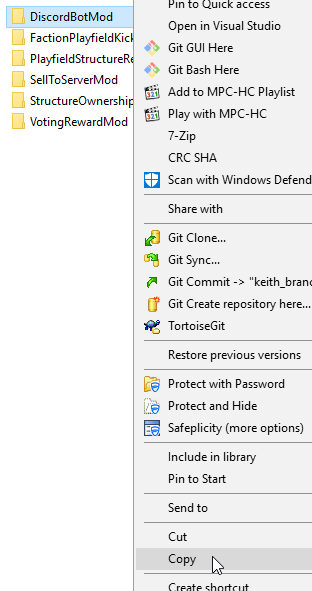

16) in the Build directory `EmpyrionNetworkConnectedMods\NetworkConnectedModRunner\bin\Release\Extensions`
    you will see a `DiscordBotMod` folder.  Copy that to your clipboard.
    
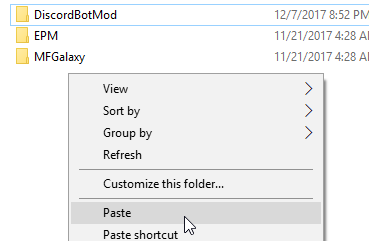

17 in the Mod directory of Empyrion `Empyrion\Content\Mods` paste the built directory you've copied from the previous
   step